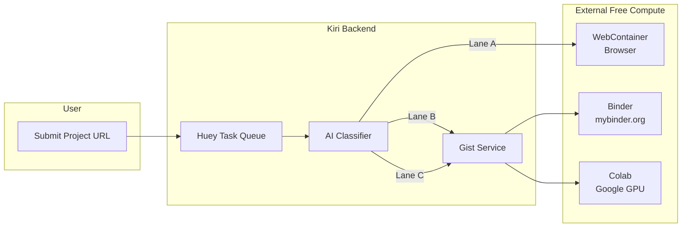
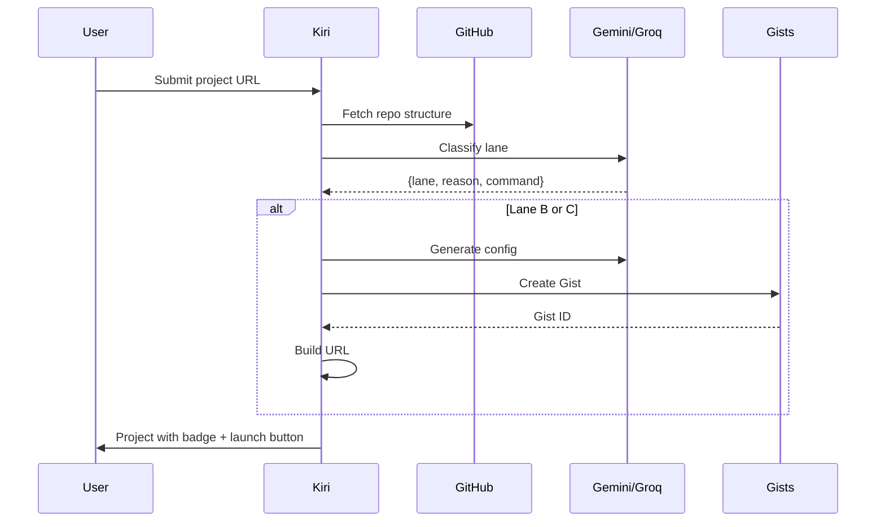

# Traffic Controller - Technical Documentation

> Enables project previews using free external compute (WebContainers, Binder, Colab).

## Architecture Overview



## Lane Classification

| Lane | Badge | Criteria | Infrastructure |
|------|-------|----------|----------------|
| **A** | 🟢 Instant Run | React, Vue, Node.js, static sites | **Kiri Studio** (Built-in IDE) |
| **B** | 🟠 Cloud Boot | Django, Flask, FastAPI, Docker | [mybinder.org](https://mybinder.org) |
| **C** | 🔴 GPU Powered | PyTorch, TensorFlow, Transformers | [Google Colab](https://colab.research.google.com) |

## Files

| File | Purpose |
|------|---------|
| `core/ai_service.py` | Gemini + Groq classification |
| `projects/gist_service.py` | GitHub Gist creation for Binder/Colab |
| `projects/models.py` | `lane`, `execution_url`, `gist_id` fields |
| `kiri_project/tasks.py` | `classify_project_lane()` background task |

## API Keys Required

```bash
# .env
GEMINI_API_KEY=...        # aistudio.google.com/apikey
GROQ_API_KEY=...          # console.groq.com/keys
KIRI_BOT_GITHUB_TOKEN=... # GitHub PAT with 'gist' scope
KIRI_BOT_USERNAME=...     # GitHub username for bot
```

## Request Flow



## URL Formats

**Binder (Lane B):**
```
https://mybinder.org/v2/gist/{username}/{gist_id}/HEAD?urlpath=proxy/{port}/
```

**Colab (Lane C):**
```
https://colab.research.google.com/gist/{username}/{gist_id}/demo.ipynb
```

## Free Tier Limits

| Service | Limit |
|---------|-------|
| Gemini 2.5 Flash | 250 req/day |
| Groq | 1000 req/day |
| Binder | 1-2GB RAM, 10min idle |
| Colab | T4 GPU, ~12hr sessions |
| GitHub Gists | Unlimited |

## Testing

```bash
uv run python test_traffic_controller.py
```
