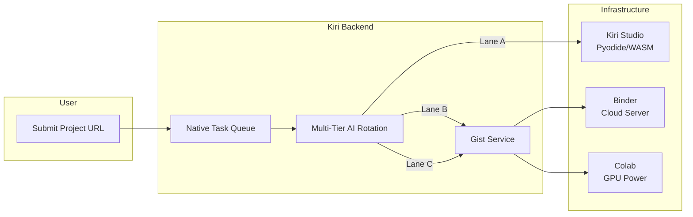

# Traffic Controller: Intelligence Scalable to Zero

> Enables multi-lane project previews using AI classification and cross-platform infrastructure.

## Architecture


```mermaid
flowchart LR
    subgraph User
        U[Submit Project URL]
    end
    
    subgraph Kiri Backend
        NT[Native Task Queue]
        AI[Multi-Tier AI Rotation]
        GS[Gist Service]
    end
    
    subgraph Infrastructure
        KS[Kiri Studio<br/>Pyodide/WASM]
        BD[Binder<br/>Cloud Server]
        CL[Colab<br/>GPU Power]
    end
    
    U --> NT
    NT --> AI
    AI --> |Lane A| KS
    AI --> |Lane B| GS --> BD
    AI --> |Lane C| GS --> CL
```

## Lane Logic

| Lane | Badge | Best For | Runner |
|------|-------|----------|--------|
| **A** | 🟢 Instant Run | React, Static, Python Scripts | **Kiri Studio** |
| **B** | 🟠 Cloud Boot | Django, Flask, Backends | [mybinder.org](https://mybinder.org) |
| **C** | 🔴 GPU Powered | ML Models, PyTorch, JAX | [Google Colab](https://colab.research.google.com) |

## Multi-Tier AI Fallback Chain
Kiri rotates through 15+ models to ensure 100% classification uptime:
1. **Tier 1 (Groq/Free)**: Moonshot (Kimi K2 Instruct), Llama 4 (Scout/Maverick), GPT OSS (120B/20B), Qwen 3.
2. **Tier 2 (Gemini/Paid)**: Gemini 3 Flash, Gemini 2.5 Flash, Gemini 3 Pro.
3. **Tier 3 (Last Resort)**: Llama 3.1 8B Instant.

## Files

| File | Purpose |
|------|---------|
| `core/ai_service.py` | Gemini + Groq classification |
| `projects/gist_service.py` | GitHub Gist creation for Binder/Colab |
| `projects/models.py` | `lane`, `execution_url`, `gist_id` fields |
| `kiri_project/tasks.py` | `classify_project_lane()` background task |

## Technical request flow
1. **Fetch**: `GitHubService` retrieves the repository file tree and key meta-files (`package.json`, `requirements.txt`).
2. **Rotation**: `AIService` sends the context to the fallback chain. It rotates through providers (Groq -> Gemini) until a valid JSON response is received.
3. **Heuristics**: If all AI models fail, `AIService._heuristic_classification` provides a regex-based fallback.
4. **Provisioning**: 
    - **Lane A**: Generates a Studio link with the repo context.
    - **Lane B/C**: `GistService` creates a bridge Gist containing the necessary environment configs (`environment.yml` or `.ipynb`).

## Testing
Verify the controller via:
```bash
uv run python manage.py test projects.tests
```

## API Keys Required

```bash
# .env
GEMINI_API_KEY=...        # aistudio.google.com/apikey
GROQ_API_KEY=...          # console.groq.com/keys
KIRI_BOT_GITHUB_TOKEN=... # GitHub PAT with 'gist' scope
KIRI_BOT_USERNAME=...     # GitHub username for bot
```

## Request Flow
1. **Submission**: User submits a GitHub URL.
2. **Analysis**: AI analyzes the repository file structure (tree).
3. **Classification**: AI returns the optimal "Lane" and specific execution commands.
4. **Provisioning**: 
    - Lane A: Loads environment in Kiri Studio.
    - Lane B/C: Kiri Bot creates a bridge Gist and prepares the redirect.

## URL Formats

**Binder (Lane B):**
```
https://mybinder.org/v2/gist/{username}/{gist_id}/HEAD?urlpath=proxy/{port}/
```

**Colab (Lane C):**
```
https://colab.research.google.com/gist/{username}/{gist_id}/demo.ipynb
```

## Free Tier Limits

| Service | Limit |
|---------|-------|
| Gemini 2.5 Flash | 250 req/day |
| Groq | 1000 req/day |
| Binder | 1-2GB RAM, 10min idle |
| Colab | T4 GPU, ~12hr sessions |
| GitHub Gists | Unlimited |

## Testing
Verify the controller via:
```bash
uv run python manage.py test projects.tests
```
